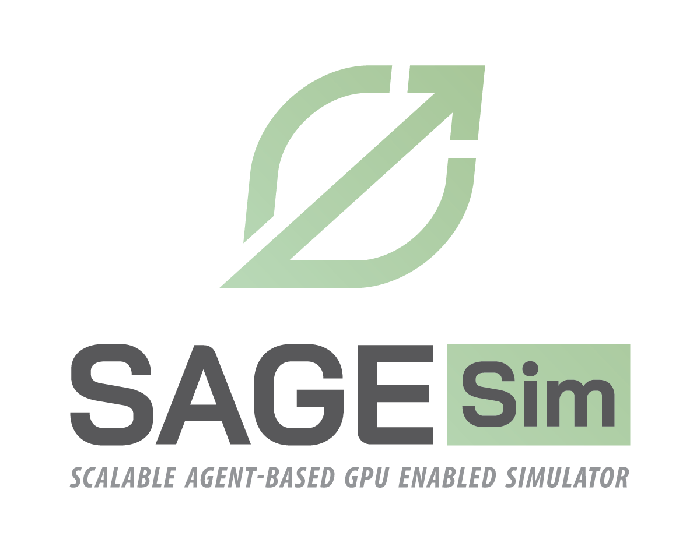

Scalable Agent-based GPU Enabled Simulator

# Requirements

 - Python 3.7+
 - `conda create -n sagesimenv python=3.9`
 - `conda activate sagesimenv`
 - `conda install -c anaconda cudatoolkit`
 - `pip install -r requirements.txt`
 
# Run Example

 - `git clone https://code.ornl.gov/sagesim/sagesim`
 - `export PYTHONPATH=/path/to/clone_repo`
 - `cd /path/to/clone_repo`
 - `python examples/sir/run.py`

# Unit Tests

To run unit tests, `cd` to root dir and run:

`python -m unittest tests.simple_agent_test`
